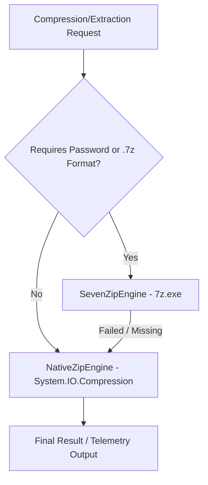

# 📐 System Architecture - GlassHubEventHorizon


**GlassHubEventHorizon** is engineered strictly following **Clean Architecture**, **Domain-Driven Design (DDD)**, and **SOLID** principles. The core goal is ensuring that file compression business logic remains completely decoupled from presentation layers (CLI and GUI).

---

## 🏗️ Layer Structure

```text
GlassHubEventHorizon/
├── GlassHub.EventHorizon.Core             # Domain Layer (Interfaces, Models, i18n)
├── GlassHub.EventHorizon.Engine.Native     # Native Engine (.NET System.IO.Compression)
├── GlassHub.EventHorizon.Engine.SevenZip   # 7-Zip CLI Engine (Supports .7z, .rar, AES-256)
├── GlassHub.EventHorizon.CLI               # Command Line Interface (evh)
└── GlassHub.EventHorizon.GUI               # Desktop GUI Application (WPF Glassmorphism)
```

---

## 🎯 Applied SOLID Principles


1. **S - Single Responsibility Principle (SRP):**
   - Each class fulfills a single role. For example, `NativeZipEngine` strictly handles native ZIP operations, while `LocalizationService` manages translations.

2. **O - Open/Closed Principle (OCP):**
   - New compression engines (such as a future proprietary V2 engine) can be integrated by implementing `IArchiveEngine` without modifying existing CLI or GUI presentation code.

3. **L - Liskov Substitution Principle (LSP):**
   - Any `IArchiveEngine` implementation (`NativeZipEngine`, `SevenZipEngine`, or `FallbackArchiveEngine`) can be substituted transparently.

4. **I - Interface Segregation Principle (ISP):**
   - The `IArchiveEngine` interface exposes only necessary operations (`Compress`, `Decompress`, `ListContents`, `GetMetadata`, `VerifyIntegrity`), eliminating bloated method signatures.

5. **D - Dependency Inversion Principle (DIP):**
   - Presentation layers (`evh` CLI and GUI) depend exclusively on abstractions (`IArchiveEngine`, `ILocalizationService`) rather than concrete implementations.

---

## ⚙️ Smart Dual-Engine Strategy (*FallbackArchiveEngine*)

To ensure 100% out-of-the-box operation on any computer without requiring pre-installed external binaries, GlassHubEventHorizon features the `FallbackArchiveEngine`:



- **`NativeZipEngine`**: Uses standard `.NET` libraries (`System.IO.Compression`). Runs seamlessly across Windows, Linux, and macOS without external dependencies.
- **`SevenZipEngine`**: Wraps the 7-Zip CLI (`7z.exe`) for advanced format compression (`.7z`, `.rar`, `.tar.gz`) and AES-256 encryption.
- **`FallbackArchiveEngine`**: Automatically selects the optimal available engine.

---

## 📊 Telemetry Model (`ArchiveMetadata`)

Inspecting any archive via `evh info` generates a comprehensive technical report:

- **File Name and Format Extension**
- **Compressed Size vs Uncompressed Size**
- **Compression Ratio (%)**
- **Entry Count (Files & Directories)**
- **Encryption Status (AES-256 / None)**
- **Engine Applied During Processing**
